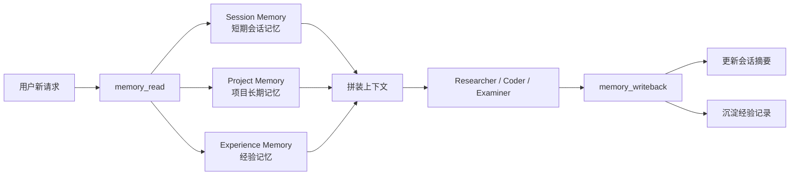
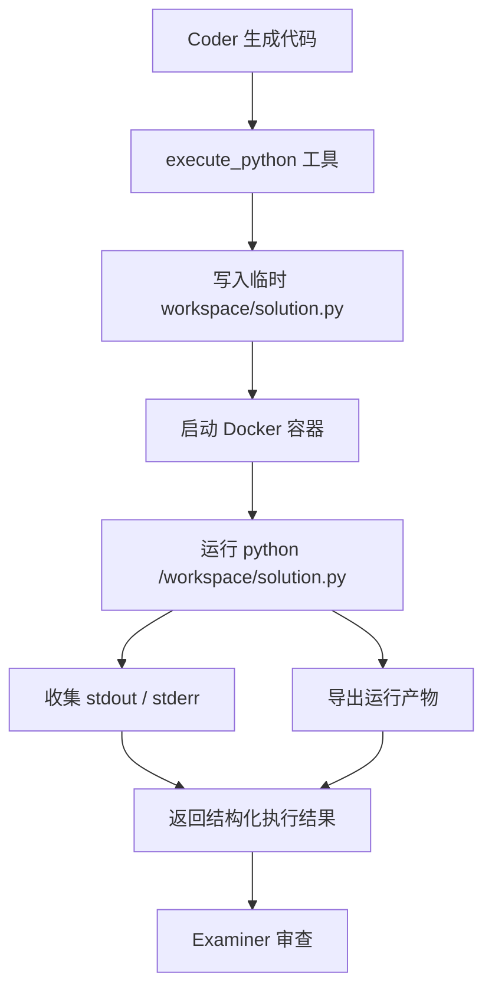
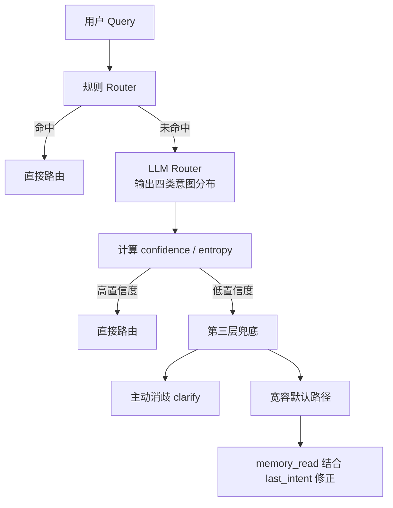

# PINN Agent V2：三个核心工作亮点

这份文档不是源码级 deep dive，而是更适合展示、汇报、面试讲述的一版提炼稿。

聚焦三个核心亮点：

1. 三层记忆架构设计
2. Docker 沙盒执行代码
3. Router 路由机制

---

## 0. 项目一句话介绍

我做的是一个面向 PINN 科研场景的 Multi-Agent 智能助手。  
它能把用户输入自动路由到“文献检索、代码生成、沙盒执行、结果审查、记忆写回”这条链路上，最后返回带引用的综述、可运行代码和产物文件。

如果只用一句话概括我这套系统的工程亮点，就是：

> 我不只是把 LLM 接起来，而是把它做成了一个“能记忆、能执行、能自我修正、还能解释自己为什么这么做”的科研助手。

---

## 1. 亮点一：三层记忆架构设计

### 1.1 一句话价值

我把记忆拆成了短期会话记忆、长期项目记忆、经验记忆三层，分别解决“当前上下文连续性”“项目级约束一致性”“历史失败模式复用”三个不同问题。

### 1.2 为什么这是亮点

很多 Agent 项目只有“聊天历史”，但真实系统里其实有三类完全不同的记忆需求：

- 当前会话里刚刚发生了什么
- 这个项目长期坚持的架构规则和偏好是什么
- 过去踩过哪些坑，以后能不能复用

如果把这些都混在一份对话历史里，问题会很明显：

- Token 会快速膨胀
- 重要约束容易被淹没
- 历史经验无法结构化复用

所以我把记忆拆成三层，每层只解决一种问题。

### 1.3 展示版流程图



### 1.4 三层记忆分别做什么

#### A. Session Memory：短期会话记忆

作用：

- 记录最近几轮 query
- 记录最近一次意图
- 记录最近一次代码、错误、产物
- 在消息过长时做压缩，避免 Token 爆炸

它不是保存完整聊天记录，而是保存“可被下游 Agent 复用的摘要状态”。

典型字段包括：

- `recent_queries`
- `last_intent`
- `last_code_snippet`
- `last_error_summary`
- `last_successful_code_snippet`
- `conversation_digest`

#### B. Project Memory：项目长期记忆

作用：

- 记录项目级目标和边界
- 固化架构决策
- 保存技术栈、偏好、已知风险

这层记忆是跨会话共享的，相当于给所有 Agent 提供一个“长期不变的项目背景”。

典型内容包括：

- 项目目标
- 架构规则
- 当前优先级
- 已接受 / 已拒绝的技术方案

#### C. Experience Memory：经验记忆

作用：

- 沉淀成功/失败案例
- 抽取错误模式
- 下次遇到相似问题时做提示复用

这层的关键不是“存日志”，而是“存可以被复用的经验模式”。

我给每条经验做了粗粒度指纹，比如：

```text
intent + error_type + query_prefix
```

这样下一次遇到类似的 `shape mismatch`、`missing_torch`、`syntax_error`，系统可以直接把之前的修复思路拿出来提示给 Coder。

### 1.5 伪代码

```python
def node_memory_read(state):
    session_summary = load_session_summary(state.session_id)
    project_memory = load_project_memory()
    experience_hints = retrieve_experience_hints(
        query=state.query,
        intent=state.intent,
        limit=3,
    )

    trimmed_messages, session_summary, compressed = compress_message_history(
        state.messages,
        session_summary,
    )

    return {
        "session_summary": session_summary,
        "project_memory": project_memory,
        "experience_hints": experience_hints,
        "messages": trimmed_messages if compressed else state.messages,
    }


def node_memory_writeback(state):
    updated_summary = build_session_summary(
        previous_summary=state.session_summary,
        state=state,
    )
    save_session_summary(state.session_id, updated_summary)

    experience_record = build_experience_record(state)
    if experience_record:
        append_experience_record(experience_record)

    return {"session_summary": updated_summary}
```

### 1.6 我实际解决了什么问题

- 解决了多轮对话里“上一轮上下文丢失”的问题
- 解决了长会话里消息越积越多、Token 失控的问题
- 解决了失败经验无法复用，只能反复踩同样坑的问题
- 让 Router、Coder、Examiner 都能读到真正对自己有用的上下文，而不是一整坨聊天记录

### 1.7 面试可讲述版本

#### 30 秒版本

我把记忆拆成了三层。  
Session Memory 负责当前会话连续性，Project Memory 负责长期项目规则，Experience Memory 负责历史错误模式复用。这样做的好处是，Agent 既不会因为上下文太长导致 Token 爆炸，也不会每次都从零开始犯同样的错误。

#### 90 秒版本

我觉得很多 Agent 项目对“记忆”这个词说得很泛，但真正落地时，至少有三类完全不同的记忆需求。  
第一类是当前会话级的短期记忆，比如上一轮生成了什么代码、报了什么错、最近一次意图是什么，这些信息需要非常快地在下一轮继续使用。  
第二类是项目级长期记忆，比如我们为什么选 LangGraph、为什么用 Docker 沙盒、当前优先级是什么，这类信息不属于某一轮对话，而是整个项目长期有效的约束。  
第三类是经验记忆，我会把每轮运行抽象成结构化记录，尤其是失败模式和修复提示，下次遇到类似错误可以直接给 Coder 提示。  
这样我不是简单地“保存聊天历史”，而是把记忆真正变成了系统能力的一部分。

---

## 2. 亮点二：Docker 沙盒执行代码

### 2.1 一句话价值

我没有让模型直接在宿主机执行代码，而是专门做了一层 Docker 沙盒，把“代码生成”和“代码执行”隔离开，保证安全性、可控性和可验证性。

### 2.2 为什么这是亮点

一个能写代码的 Agent，如果不能安全执行代码，演示效果很容易停留在“会写不会跑”。  
但如果直接在宿主机执行，又会带来明显风险：

- 误删文件
- 访问网络
- 占满资源
- 环境污染
- 不同轮次相互影响

所以我把执行环境做成了一个受控沙盒，而不是把 `subprocess` 直接暴露给模型。

### 2.3 展示版流程图



### 2.4 沙盒设计要点

#### A. 执行环境隔离

容器不是挂载整个项目目录，而是只挂载临时运行目录：

- `/workspace`：放这次要执行的代码
- `/tmp`：容器内运行期临时文件

这样做的好处是：

- 本轮代码和宿主机项目解耦
- 不会误读到宿主机里未授权文件
- 每次执行环境更接近“从零开始”

#### B. 资源和权限限制

沙盒默认限制：

- `--network none`：完全断网
- `--cpus=2`：限制 CPU
- `--memory=2g`：限制内存
- 非 root 用户运行
- 超时强制 kill

也就是说，模型即使生成了高风险代码，最多也是在一个受限容器里失败，不会直接污染宿主机。

#### C. 结果可验证

执行结果不是一句“运行成功”，而是结构化返回：

- `execution_success`
- `execution_stdout`
- `execution_stderr`
- `artifact_paths`

这样 Examiner 可以基于真实运行结果审查，而不是只审代码文本。

#### D. 产物导出

运行中生成的：

- 日志文件
- 图片
- 文本结果

都会从容器里导回宿主机 `outputs/sandbox_runs/...`。  
这对演示很重要，因为它让系统不是“说自己运行过”，而是真正把结果带回来。

### 2.5 伪代码

```python
def run_python(code, timeout=30):
    run_dir = create_unique_run_dir()
    workspace = run_dir / "workspace"
    tmp_dir = run_dir / "container_tmp"

    write_text(workspace / "solution.py", code)

    container = docker.run(
        image="pinn_agent_sandbox:latest",
        command=["python", "/workspace/solution.py"],
        network_disabled=True,
        cpu_limit=2,
        mem_limit="2g",
        user="1001:1001",
        mounts=[
            (workspace, "/workspace"),
            (tmp_dir, "/tmp"),
        ],
    )

    result = wait_container(container, timeout=timeout)
    stdout, stderr = read_logs(container)
    artifacts = export_runtime_artifacts(workspace, tmp_dir)

    cleanup(container, run_dir)

    return {
        "success": result.exit_code == 0,
        "stdout": stdout,
        "stderr": stderr,
        "artifacts": artifacts,
    }
```

### 2.6 我实际解决了什么问题

- 解决了模型生成代码“能写不能跑”的问题
- 解决了执行不安全、宿主机易污染的问题
- 解决了运行结果无法被 Examiner 验证的问题
- 解决了日志、图片等产物只存在容器里、宿主机看不到的问题

### 2.7 面试可讲述版本

#### 30 秒版本

我专门做了一层 Docker 沙盒来执行模型生成的代码，而不是直接在宿主机跑。这样可以做到断网、限资源、非 root、超时 kill，同时还能把运行日志和图片产物导回宿主机。它解决的是 Agent “会写代码”到“能安全执行并验证代码”之间的最后一公里。

#### 90 秒版本

我觉得一个代码 Agent 真正有说服力，不是它能生成多少 Python，而是它生成完以后能不能真的安全跑起来。  
所以我没有直接在宿主机暴露执行权限，而是做了一个 Docker 沙盒。每次执行都会把代码写到临时 `workspace`，在一个断网、限 CPU、限内存、非 root 的容器里运行。运行结束以后，我会收集 stdout、stderr，再把日志、图片这些产物导回宿主机。  
这样一来，Coder 不是只负责“写代码”，而是能形成“生成代码 -> 沙盒执行 -> 获取真实结果 -> Examiner 审查 -> 重试修复”的完整闭环。这个设计让系统更安全，也让演示效果更真实。

---

## 3. 亮点三：Router 路由机制

### 3.1 一句话价值

我把意图识别从“单次分类器”升级成了一个分层 Router：高频显式请求走规则，模糊请求走 LLM 概率分布，低置信度时再进入主动消歧或宽容默认，从而更适合真实对话场景里的隐含意图和信息不足。

### 3.2 为什么这是亮点

很多项目里的 Router 只有两种状态：

- 能分类
- 分类错了

但真实用户输入经常不是干净的 benchmark 样本，而是：

- “帮我看一下这个”
- “继续上次那个”
- “先解释一下再改代码”
- “帮我修一下这个 PINN 报错”

这种 query 的难点不是“模型不够强”，而是**用户表达天然就不完整**。  
所以我把 Router 设计成了一个**会判断自己是否确定**的系统，而不是一个永远强行给答案的分类器。

### 3.3 展示版流程图



### 3.4 三层 Router 分别解决什么问题

#### A. 第一层：规则 Router

作用：

- 快速覆盖高频显式模式
- 零成本、零延迟
- 降低 LLM 路由调用次数

例如：

- 同时出现“综述 + 写代码” → `full_pipeline`
- 出现“调试 / 修复 / 运行 / 训练” → `code`
- 出现“文献 / 综述 / 调研 / review” → `survey`

#### B. 第二层：LLM Router

作用：

- 处理规则无法覆盖的模糊请求
- 不只输出一个标签，而是输出四类意图分布

这一层的输出包括：

- `intent`
- `scores`
- `confidence`
- `entropy`
- `missing_information`
- `clarification_question`

这让 Router 不只是“分类”，而是“分类 + 解释 + 暴露不确定性”。

#### C. 第三层：低置信度兜底

这里分成两种策略：

**1. 主动消歧**

如果分布过平、第一第二候选太接近、或者 query 明显依赖上下文，就进入 `clarify` 节点，先问用户一句更关键的问题。

**2. 宽容默认**

如果 query 虽然不完整，但动作意图已经很明显，比如“帮我修一下这个报错”，系统就不会过度追问，而是优先继续执行默认路径。

#### D. Session-aware 跟随修正

这是我觉得比较有意思的一点。  
如果当前 query 是“继续上次那个”这种上下文型 follow-up，Router 可能会先保守地给出 `clarify`。但进入 `memory_read` 后，系统能看到上一轮的 `last_intent`，如果上一轮明确是 `code`，那这一轮就直接修正回 `code` 路径。

这说明 Router 不是一个孤立模块，而是和记忆层联动的。

### 3.5 伪代码

```python
def resolve_intent(query):
    # 第一层：规则直达
    rule_decision = rule_router(query)
    if rule_decision is not None:
        return rule_decision

    # 第二层：LLM 输出分布
    llm_decision = llm_router(query)
    confidence = max(llm_decision.scores.values())
    entropy = normalized_entropy(llm_decision.scores)

    # 高置信度 → 直接路由
    if confidence >= CONF_THRESHOLD and entropy <= ENTROPY_THRESHOLD:
        return llm_decision

    # 第三层：低置信度兜底
    default_intent = choose_tolerant_default(query, llm_decision.scores)

    if should_ask_for_clarification(query, llm_decision):
        return RouterDecision(
            intent="clarify",
            needs_clarification=True,
            clarification_question=build_question(...),
            default_intent=default_intent,
        )

    return RouterDecision(
        intent=default_intent,
        defaulted=True,
    )


def node_memory_read(state):
    session_summary = load_session_summary(state.session_id)

    if state.intent == "clarify" and looks_like_contextual_followup(state.query):
        if session_summary.last_intent in {"qa", "survey", "code", "full_pipeline"}:
            state.intent = session_summary.last_intent
            state.router_source = "session_default"
            state.router_defaulted = True

    return state
```

### 3.6 我实际解决了什么问题

- 解决了 query 模糊时 Router 硬分类、硬误判的问题
- 解决了“继续上次那个”这类多轮 follow-up 很难单轮判断的问题
- 解决了系统永远装作很确定，缺乏自我不确定性表达的问题
- 让 Router 从一个小分类器，变成了一个真正参与交互设计的调度器

### 3.7 面试可讲述版本

#### 30 秒版本

我把 Router 从一个简单分类器升级成了三层机制。高频显式请求先走规则，模糊请求再走 LLM 概率分布，低置信度时要么主动消歧，要么按默认路径宽容执行。这样它能更好地处理真实用户输入里的隐含意图和上下文依赖。

#### 90 秒版本

我后来发现，Router 最大的问题不是“分类精度不够”，而是很多真实 query 本身就不完整。  
比如用户会说“帮我看一下这个”“继续上次那个”“先解释一下再改代码”，这种输入如果硬要模型一次性给出标签，很容易误路由。  
所以我把 Router 改成了三层。第一层是规则 Router，用来覆盖高频显式模式，零成本、零延迟。第二层才是 LLM Router，但它不只输出一个类别，而是输出四类意图的分布，我再根据最大概率和熵判断这次分类到底稳不稳。第三层是低置信度兜底，如果确实不确定，就进入主动消歧；如果虽然不完整但动作倾向很强，就宽容地继续执行默认路径。  
另外我还让 Router 和记忆层联动，多轮 follow-up 时可以复用上一轮的主意图。这样 Router 就不只是“分流器”，而是整个多轮交互体验的一部分。

---

## 4. 三个亮点之间的关系

这三个亮点不是彼此孤立的，它们实际上组成了一个闭环：

- Router 决定请求先走哪条路径
- Agent 生成的代码通过 Docker 沙盒安全执行
- 执行结果和错误模式再回写到三层记忆里
- 下一轮 Router 和 Coder 又能利用这部分记忆继续推理

也就是说，这个系统真正的工程特点不在单点能力，而在于：

> 我把“路由、执行、记忆”三件事做成了一个互相增强的闭环系统。

---

## 5. 最适合展示的总述版本

如果要把整个项目浓缩成一段 1 分钟左右的展示，我会这样讲：

> 我的项目是一个面向 PINN 科研场景的 Multi-Agent 助手，核心不是单纯接一个大模型，而是围绕三个工程问题做了系统化设计。  
> 第一，我设计了三层记忆架构，把短期会话上下文、长期项目约束和历史经验模式拆开管理，解决多轮连续性和经验复用问题。  
> 第二，我做了 Docker 沙盒执行层，让模型生成的代码不是停留在文本层，而是真的能在隔离环境里运行、产生产物、再被审查。  
> 第三，我把 Router 从简单分类器升级成三层机制，能处理隐含意图、信息不足和多轮 follow-up，在不确定时主动消歧，在明确时又能低延迟直达。  
> 这三个设计组合起来，让这个系统不是“会说”，而是“能记、能跑、能解释、还能修”。
